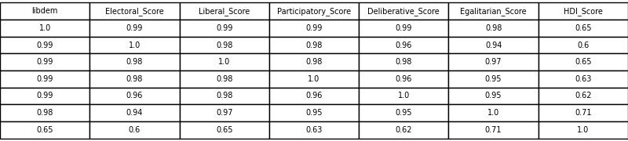

# Table of Contents
- [Data Summary](#data-summary)
    - [Violence Summary](#violence-summary)
    - [Accomodation Summary](#accomodation-summary)
    - [Violence by Region](#violence-by-region)
- [K Means Clustering](#k-means-clustering)
    - [Clusters Summary](#clusters-summary)
    - [Clusters Detail](#clusters-detail)

# Data Summary

The protest dataset has info about 12,652 different protests against government from 132 countries between 1990 and 2019. The average number of protests per year has nearly doubled since 2010 (from 343 before 2010 to 605 after).

<table>
<td>

</td>
</table>

The plurality of protests (33 percent) are from Europe; only 38 are from Oceania. We will use the distribution of protests across regions as a baseline for comparing statistics across clusters. We expect that any measurements will tend be more prevalent in Europe than other places solely because there are more protests recorded from Europe, for example.

<table>
  <tr>
    <td></td>
    <td style="text-align:center;">
(relevant xkcd comic)
</td>
  </tr>
    <tr>
    <td></td>
    <td></td>
  </tr>
</table>

The Varieties of Democracy variables are different components of measuring each countries liberal democracy level at the time of a protest. For each data point, these five scores tend to be highly correlated (r > 0.90). To limit the number of feature inputs, I combine these into a single measure called `libdem` which is the average of the five scores. In contrast, the HDI score is much less correlated with these scores and it is left to be included in models as a separate measure. HDI is most correlated with the Egalitarian component (r = 0.70).

<table>
<td>

</td>
</table>

To examine state response patterns, I create an indicator `stateviolence`, which is 1 if any `stateresponse*` variable is 'arrests', 'beatings', 'crowd dispersal', 'shootings', or 'killings'; and I create an indicator `accomodation` if any `stateresponse*` variable is 'accomodation'.

## Violence Summary

 - 56 percent of all protests were completely peaceful. Neither protesters nor the state engaged in any violence. 
 - 26 percent of protests had some level of protester violence.
    - Of those, 86 percent were met with state violence.
 - 18 percent of protests were peaceful protests that were met with state violence. A total of 40 percent had state violence, and only about half of these were in response to protester violence.

 

 ## Accomodation Summary

 - Only 10 percent of protests led to accomodations by the government.

 The distribution of violence for protests that led to accomodations is similar to the overall distribution of violence. Of the protests that led to accomodations:

 - 60 percent were completely peaceful,
 - 28 percent had protestor violence,
    - (75 percent of these were met with state violence), and
 - 12 percent had state violence to a peaceful protest.

<table>
  <tr>
    <td></td>
    <td></td>
  </tr>
  <tr>
    <td></td>
    <td style="text-align:center;">
I mean, they're not. But they are about the same.
</td>
  </tr>
</table>

## Violence by Region

Overall, Africa and MENA have the highest rates of violence in protests. The violence in MENA is exceptional because it consists of a much higher-than-average level of state violence against peaceful protesters. North and Central America, on the other hand, have a higher-than-average rate of protester-only violence.

Europe and South America have the highest rates of non-violent protests. In Europe, the rates of all types of violence are lower than average; but in South America, the rate of state-only violence is the same as in other regions, despite the overall lower rate of violence. So both MENA and South America have higher-than-average levels of state-only violence.

Oceania has the lowest rate of state-only violence (and also the highest rate of accomodations).

<table>
  <tr>
    <td></td>
    <td></td>
  </tr>
</table>

# K Means Clustering

We have 12,652 protests that we want to cluster into groups based on five variables: Region, Violence, Liberal Democracy Score, HDI Score, and whether a protest resulted in state accomodations. Region has eight categories and Violence has four. So we have a total of 15 features by which to group our protests.

Graphing the within-cluster sum of squares (WCSS) for each possible number of clusters, we can see pretty sharp elbow at 3 clusters.

<table>
  <tr>
    <td></td>
    <td></td>
  </tr>
  <tr>
    <td></td>
    <td style="text-align:center;">
That elbow is sharp!
</td>
  </tr>
</table>

So we fit the three-means clustering model to our data, and we end up with a Silhouette Score of about 0.39. Just over half of our protests (56 percent) fall into the same cluster (labeled `0` here). Cluster `1` has exactly its fair share of protests (34 percent), and the rest (10 percent) are on their own in Cluster `2`.

## Clusters Summary

In summary, we have three clusters of protests:
- Protests that have more violence from both protesters and the state.
    - Protests tend to be more violent when the government has lower Liberal Democracy and HDI Scores.
    - These protests tend to happen in regions that are not Europe or South America.
    - These are the most common protests.
- Protests with less violence.
    - These protests tend to happen in governments with higher Liberal Democracy and HDI Scores, and more often in Europe and South America.
    - These protests are more peaceful, but also do not end with state accomodations.
- Protests that have state accomodations.
    - These protests tend to have higher levels of protester-only violence. 
    - These protests tend to happen in all kinds of governments, in all regions--except more often in Oceania.
 
## Clusters Detail

Each cluster has an even distribution of years, indicating that whatever makes one protest similar or distinct with this data is relatively consistent since 1990. 

There is, however, some clumping of regions within our clusters. Europe and South America are both underreprestented in Cluster `0` and overrepresented in Cluster `1`. In fact, Cluster `1` is almost exclusively (93 percent) made up of European and South American protests. Cluster `0` has just a bit less of these two regions in favor of the others, and Cluster `2` has a distribution that is about the same as the general distribution of regions. 

On the right side, we see these same patterns (Europe and South America are more in Cluster `1`, less in others). We also see that Oceania is overrepresented in Cluster `2` whereas all the other regions that have fewer protests in Cluster `1` tend to have more in Cluster `0`.

In summary, Cluster `1` is a bunch of Europe and South America; everyone else moved a bit from Cluster `1` to Cluster `0`, except Oceania moved from Cluster `1` to Cluster `2`.

<table>
  <tr>
    <td></td>
    <td></td>
  </tr>
</table>

Now we see that Cluster `2` has all the protests with accomodations. So the distribution of regions for protests that have accomodations matches the overall distribution of regions--except that Oceania tends to have more accomodations (which matches what we already knew about Oceania). We also see that the average Libdem and HDI Scores for this Cluster matches the overal average.

Cluster `0` has the lower-than-average Libdem and HDI Scores; Cluster `1`, the higher.

Finally, we can look at the levels of violence for these clusters. Cluster `0` has more violence overall; Cluster `1` has more non-violent protests; and Cluster `2` has a lower-than-normal percent of state-only violence, and more protester-only violence. This is really the main variable that sets Cluster `2` apart: more protester-only violence.

